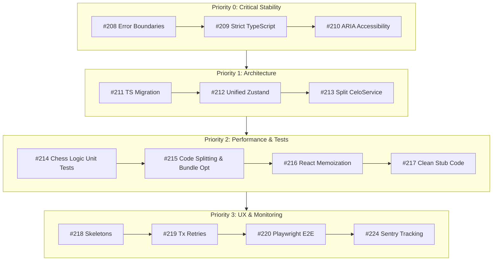

# 📋 Frontend Improvement Roadmap 2025

This document outlines the comprehensive frontend engineering roadmap established from the January 2025 codebase audit for ChessXU. It tracks architecture, security, performance, accessibility, testing, and user experience enhancements across 17 prioritized issues.

---

## 🎯 Executive Summary & Priority Matrix

| Priority | Category | Issues | Estimated Effort | Focus Area |
| :--- | :--- | :--- | :--- | :--- |
| **P0** | Critical | #208, #209, #210 | 15–22 hours | Security, Stability, ARIA Accessibility |
| **P1** | High | #211, #212, #213 | 34–50 hours | Architecture, Code Quality & Refactoring |
| **P2** | Medium | #214, #215, #216, #217 | 36–58 hours | Testing Coverage, Performance & Memoization |
| **P3** | UX & Polish | #218, #219, #220, #221, #222, #223, #224 | 32–53 hours | UX Polish, Animations, Retries, Monitoring |
| **Total** | **Meta Roadmap** | **17 Issues (#208–#224)** | **~117–183 hours** | **Comprehensive Frontend Modernization** |

---

## 🔴 Priority 0 (Critical - Security & Stability)

### [#208] Add Error Boundary to Chess Game
- **Goal**: Prevent whole-app white screen crashes during rendering or web worker errors in active chess matches.
- **Scope**: Wrap `<ChessGameWrapper>` with a specialized `React.Component` ErrorBoundary with fallback UI allowing game state recovery or board state preservation.
- **Estimated Effort**: 4–6 hours

### [#209] Replace 'any' Types with Proper TypeScript Types
- **Goal**: Eliminate 45+ `any` occurrences across contract services, custom hooks, and state stores.
- **Scope**: Define `CeloGameStruct`, `CeloscanTxResult`, `GasSponsorshipInfo`, enforce `noImplicitAny: true` in `tsconfig.app.json`, and remove all `eslint-disable @typescript-eslint/no-explicit-any` comments.
- **Status**: Completed in PR #226.
- **Estimated Effort**: 6–10 hours

### [#210] Add Accessibility (ARIA) Support to Chess Board
- **Goal**: Ensure screen reader accessibility and keyboard navigation compliance (WCAG 2.1 AA).
- **Scope**: Add ARIA roles (`role="grid"`, `role="gridcell"`), `aria-label` piece descriptions, square coordinates, and keyboard arrow navigation.
- **Estimated Effort**: 5–6 hours

---

## 🟠 Priority 1 (High - Architecture & Code Quality)

### [#211] Migrate JavaScript Files to TypeScript
- **Goal**: Convert remaining legacy `.js`/`.jsx` files in `src/chess` to strict `.ts`/`.tsx`.
- **Scope**: Convert components in `src/chess/components/`, helper utilities in `src/chess/helper/`, and AI analysis scripts.
- **Estimated Effort**: 12–18 hours

### [#212] Consolidate State Management (Zustand + Context → Zustand Only)
- **Goal**: Eliminate dual state duplication between legacy React Context (`AppContext`) and global Zustand store (`useAppStore`).
- **Scope**: Migrate board position, turn, movesList, timer, and selected piece state directly into unified Zustand slices.
- **Estimated Effort**: 12–16 hours

### [#213] Split celoService into Focused Service Modules
- **Goal**: Decompose monolithic `celoService.ts` (800+ lines) into modular services.
- **Scope**: Extract `celoContractService.ts`, `paymasterService.ts`, `feeCurrencyService.ts`, and `celoWalletService.ts`.
- **Estimated Effort**: 10–16 hours

---

## 🟡 Priority 2 (Medium - Testing & Performance)

### [#214] Add Comprehensive Test Coverage for Chess Logic
- **Goal**: Achieve >85% unit test coverage for `arbiter`, FEN conversion, AI minimax evaluation, and game state transitions.
- **Scope**: Add Vitest/Jest unit test suites targeting edge cases in pawn promotion, en passant, castling rights, and checkmate verification.
- **Estimated Effort**: 14–20 hours

### [#215] Implement Code Splitting and Bundle Optimization
- **Goal**: Reduce initial JavaScript bundle size from >1.2MB to <350KB for fast MiniPay load times.
- **Scope**: Implement dynamic imports (`React.lazy`), Rollup chunk splitting in `vite.config.ts`, and tree-shaking for `viem` / `@stacks/connect`.
- **Estimated Effort**: 8–12 hours

### [#216] Optimize React Re-renders with Memoization
- **Goal**: Eliminate unnecessary re-renders of the 64 board squares on every move or timer tick.
- **Scope**: Wrap `SquareComponent`, `BoardComponent`, and sidebar panels with `React.memo` and custom `arePropsEqual` comparators.
- **Estimated Effort**: 8–12 hours

### [#217] Fix Incomplete TODO Items and Remove Stub Code
- **Goal**: Clean up 15+ inline `TODO` comments, dummy balance mocks, and dead code pathways.
- **Scope**: Replace dummy balances in `StakingModal`, implement game duration estimates, and remove deprecated functions.
- **Estimated Effort**: 6–14 hours

---

## 🔵 Priority 3 (Nice to Have - UX & Features)

### [#218] Add Loading Skeletons and Improve Loading States
- **Goal**: Provide smooth Skeleton loading states for leaderboard rows, profile stats, and game history cards.
- **Estimated Effort**: 4–6 hours

### [#219] Implement Retry Mechanism for Failed Transactions
- **Goal**: Add automated backoff retry logic and user toast options for network timeouts on Stacks & Celo transactions.
- **Estimated Effort**: 5–8 hours

### [#220] Add E2E Tests with Playwright
- **Goal**: Set up end-to-end tests covering full match flows, wallet connection, offline mode fallback, and leaderboard loading.
- **Estimated Effort**: 8–12 hours

### [#221] Update README and Documentation
- **Goal**: Update technical architecture, local setup instructions, SDK documentation, and gasless transaction flow docs.
- **Estimated Effort**: 3–5 hours

### [#222] Add Move Animation for Smooth Piece Transitions
- **Goal**: Implement smooth CSS/Framer-Motion piece slide transitions during moves.
- **Estimated Effort**: 4–8 hours

### [#223] Add Game History Filters and Search
- **Goal**: Allow filtering game history by result (Win/Loss/Draw), chain (Celo/Stacks), and wager currency.
- **Estimated Effort**: 4–8 hours

### [#224] Add Sentry Error Tracking
- **Goal**: Integrate Sentry SDK for client-side exception capture, breadcrumbs, and performance monitoring.
- **Estimated Effort**: 4–6 hours

---

## 🗓️ Suggested Implementation Sequence

---

## 🛠️ Contribution Guidelines & Standards

1. **Commit Policy**: Use Conventional Commits (`feat(...)`, `refactor(...)`, `test(...)`, `docs(...)`).
2. **Type Safety**: All new code must be strictly typed in TypeScript with `noImplicitAny: true`.
3. **Verification**: Run `npm --prefix frontend run type-check`, `npm --prefix frontend run lint`, and `npm test` before pushing PRs.
